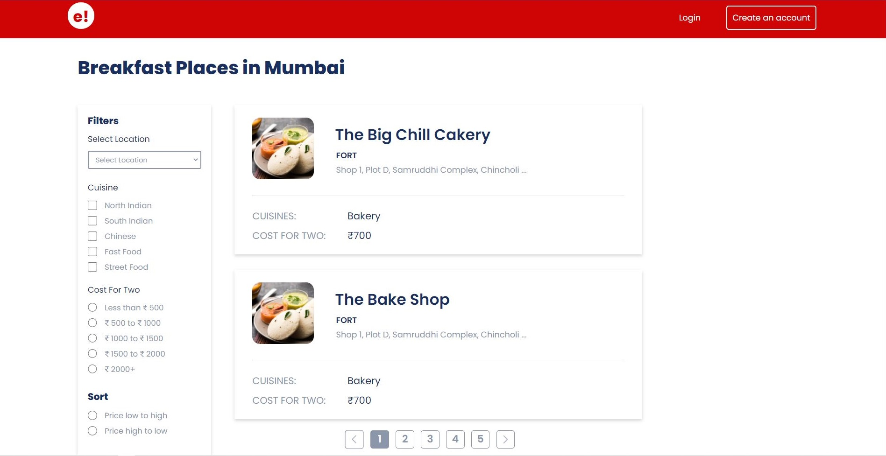

# Assignment 1

This assignment was to create a static web page using HTML and CSS, of a Food Ordering app. This helped us using differnt HTML tags as per the required use case and adding styles to the elments using CSS.

Live link of the assignment  
[Assignment 2 live link](https://sibilsoren.github.io/MyAssignment/)

